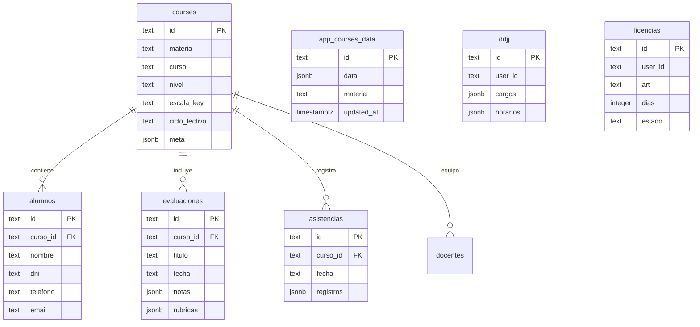

# ATRIL 5.0 · Sistema Integral de Gestión Docente & Normativa

<p align="center">
  
  
  
  
</p>

---

## 📖 Descripción General

**ATRIL 5.0** es una plataforma SaaS integral para la labor docente en instituciones educativas de nivel Secundario, Terciario y Superior. Diseñada bajo una arquitectura **Local-First de Alta Disponibilidad**, permite trabajar de manera fluida sin conexión a internet y sincronizar automáticamente en tiempo real mediante **Supabase PostgreSQL & Realtime Engine**.

Integra las regulaciones provinciales de la Provincia de Jujuy y marcos pedagógicos de Argentina:
- **Declaración Jurada de Cargos e Incompatibilidad Horaria (Ley Provincial Nº 3416/77).**
- **Régimen de Licencias Docentes (Decreto 561-G-71) y emisión de notas formales.**
- **Simulador de Puntaje para Junta de Clasificación según Estatuto Docente.**

---

## ⚡ Características Principales

### 1. Gestión de Aulas y Estudiantes
- Matriculación ágil con datos de contacto, DNI, teléfono y tutor.
- Enlace directo a **WhatsApp (`wa.me`)** y correo electrónico para comunicación con familias.
- **Importador OCR con Inteligencia Artificial (`Tesseract.js`):** digitalización de listas y nóminas en papel mediante fotos o escaneos ejecutados 100% en el navegador (respetando la privacidad del estudiante).
- Dossier individual por estudiante con historial de calificaciones, alertas y gráfico de rendimiento.

### 2. Matriz de Calificaciones (Gradebook)
- Planilla interactiva con cálculo automático de promedios ponderados.
- Soporte para múltiples escalas: numérica (1 a 10, 1 a 100) y conceptual (A, B, C, D / Sobresaliente, Distinguido, Bueno, Regular, Desaprobado).
- Rúbricas analíticas cualitativas integradas por evaluación.
- Radar pedagógico de detección temprana de estudiantes en riesgo.

### 3. Asistencias en Tiempo Real
- Registro diario táctil con cálculo instantáneo de porcentajes de presencialidad.
- Estados: Presente (P), Ausente (A), Justificado (J), Tarde (T).
- Historial acumulativo por período y ciclo lectivo.

### 4. Normativa y Documentación Oficial
- **Declaración Jurada Ley 3416/77:** control inteligente de superposición horaria y cálculo de tope semanal de horas cátedra / reloj. Generador de formulario oficial A4 listo para imprimir.
- **Licencias Docentes Dec. 561/71:** catálogo de artículos (enfermedad, estudio, duelo, maternidad, causas particulares) con emisión de solicitud formal para presentar en Secretaría.
- **Estatuto Docente:** compendio reglamentario y simulador de puntaje para concursos.

---

## 🏗️ Arquitectura Tecnológica

| Componente | Tecnología / Servicio | Propósito |
| :--- | :--- | :--- |
| **Frontend** | HTML5 Semántico, Vanilla CSS3, JavaScript ES2024 | Cero dependencias pesadas, carga instantánea (<100ms) y rendimiento óptimo. |
| **Diseño & UI** | Design System propio con Modo Claro / Modo Oscuro | Microinteracciones, scrollbars ergonómicas SaaS, tipografía Google Fonts (*Instrument Sans* / *Sora*). |
| **Base de Datos** | **Supabase PostgreSQL 17** | Proyecto `avpdyesbyzxterlfxsou` (`https://avpdyesbyzxterlfxsou.supabase.co`). |
| **Sincronización en Vivo** | **Supabase Realtime (`postgres_changes`)** | Replicación multi-dispositivo instantánea mediante WebSockets bidireccionales. |
| **Persistencia Local** | `localStorage` + In-Memory Reactive State | Operación 100% offline garantizada. |
| **Procesamiento OCR** | `Tesseract.js` (Web Worker local) | Extracción de texto en imágenes sin subir datos a servidores de terceros. |
| **Seguridad de Servidor** | Netlify Security Headers (CSP, HSTS, X-Frame-Options) | Prevención estricta de ataques XSS, Clickjacking y exfiltración. |

---

## 🗄️ Esquema de Base de Datos en Supabase

El esquema relacional y de snapshot se encuentra en `supabase/schema.sql`:



### Tablas Principales
1. `app_courses_data`: Snapshot JSONB de alta velocidad (0ms) para sincronización en tiempo real y respaldo integral del estado.
2. `courses`: Materias, cursos, ciclos lectivos y metadatos.
3. `alumnos`: Estudiantes matriculados, datos de contacto y observaciones.
4. `evaluaciones`: Exámenes, trabajos prácticos, rúbricas y matriz de notas.
5. `asistencias`: Registros diarios por fecha y alumno.
6. `docentes`: Docente titular y equipo pedagógico.
7. `ddjj`: Declaraciones juradas de cargos y compatibilidad horaria.
8. `licencias`: Registro de solicitudes de licencias y certificados médicos.
9. `_atril_ping`: Health-check y diagnóstico de latencia.

---

## 🚀 Despliegue en Producción

### 1. Despliegue en Netlify
1. Conectar el repositorio en [Netlify](https://app.netlify.com).
2. Configurar:
   - **Publish directory:** `.`
   - **Build command:** *(dejar vacío)*
3. El archivo `netlify.toml` ya incluye las directivas de seguridad CSP, encabezados HTTP y reglas de redirección SPA `/* -> /index.html`.

### 2. Inicialización de la Base de Datos en Supabase
Ejecutar el archivo `supabase/schema.sql` en el [SQL Editor de Supabase Dashboard](https://supabase.com/dashboard/project/avpdyesbyzxterlfxsou/sql) o mediante Supabase CLI:

```powershell
# Iniciar sesión en Supabase CLI
npx.cmd supabase login --token <TU_PERSONAL_ACCESS_TOKEN>

# Vincular proyecto
npx.cmd supabase link --project-ref avpdyesbyzxterlfxsou

# Empujar cambios de base de datos
npx.cmd supabase db push
```

---

## 🔒 Políticas de Seguridad & Privacidad

- **Zero-Config Client:** La clave pública (`anon key`) se encuentra restringida por políticas **Row Level Security (RLS)** en PostgreSQL.
- **Sin Dependencias de Terceros Vulnerables:** Código vanilla estructurado sin librerías externas superfluas.
- **Escape HTML Riguroso:** Toda entrada de texto de usuario se sanea con `esc()` antes de ser procesada.

---

## 📄 Licencia

Desarrollado para el sistema educativo de nivel Secundario y Superior. Todos los derechos reservados © 2026.
