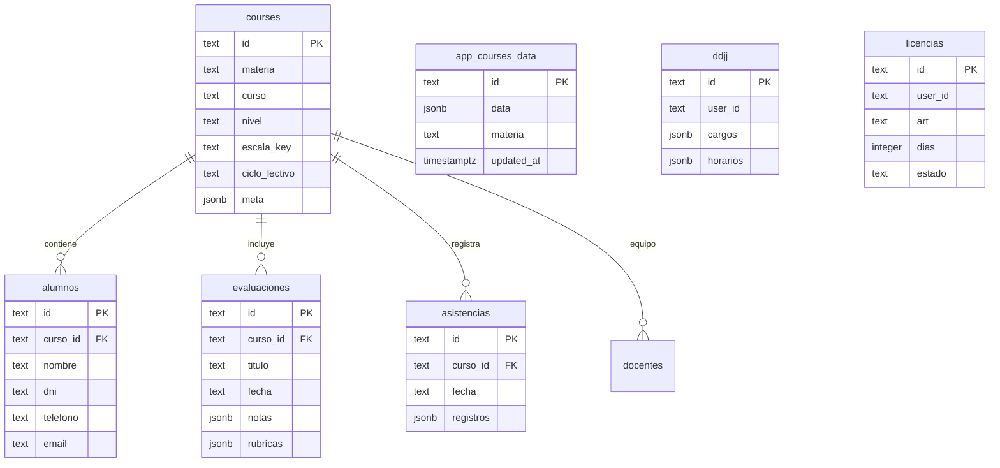

# ATRIL 5.0 · Sistema Integral de Gestión Docente & Normativa

<p align="center">
  
  
  
  
  
</p>

---

## 📖 Descripción General

**ATRIL 5.0** es una plataforma SaaS integral para la labor docente en instituciones educativas de nivel Secundario, Terciario y Superior. Diseñada bajo una arquitectura **Local-First de Alta Disponibilidad**, permite trabajar de manera fluida sin conexión a internet y sincronizar automáticamente en tiempo real mediante **Supabase PostgreSQL & Realtime Engine**.

Integra las regulaciones provinciales de la Provincia de Jujuy y marcos pedagógicos de Argentina:
- **Declaración Jurada de Cargos e Incompatibilidad Horaria (Ley Provincial Nº 3416/77).**
- **Régimen de Licencias Docentes (Decreto 561-G-71) y emisión de notas formales.**
- **Simulador de Puntaje para Junta de Clasificación según Estatuto Docente.**

---

## ⚡ Características Principales

### 1. Gestión de Aulas y Estudiantes
- Matriculación ágil con datos de contacto, DNI, teléfono y tutor.
- Enlace directo a **WhatsApp (`wa.me`)** y correo electrónico para comunicación con familias.
- **Importador OCR con Inteligencia Artificial (`Tesseract.js`):** digitalización de nóminas en papel ejecutada 100% en el navegador (respetando la privacidad del estudiante).
- Dossier individual por estudiante con historial de calificaciones, alertas y gráfico de rendimiento.

### 2. Matriz de Calificaciones (Gradebook)
- Planilla interactiva con cálculo automático de promedios ponderados.
- Soporte para múltiples escalas: numérica (1 a 10, 1 a 100) y conceptual (A, B, C, D / Sobresaliente a Desaprobado).
- Rúbricas analíticas cualitativas integradas por evaluación.
- Radar pedagógico de detección temprana de estudiantes en riesgo.

### 3. Asistencias en Tiempo Real
- Registro diario táctil con cálculo instantáneo de porcentajes de presencialidad.
- Estados: Presente (P), Ausente (A), Justificado (J), Tarde (T).
- Historial acumulativo por período y ciclo lectivo.

### 4. Normativa y Documentación Oficial
- **Declaración Jurada Ley 3416/77:** control inteligente de superposición horaria y cálculo de tope semanal de horas cátedra / reloj. Generador de formulario oficial A4 listo para imprimir.
- **Licencias Docentes Dec. 561/71:** catálogo de artículos (enfermedad, estudio, duelo, maternidad, causas particulares) con emisión de solicitud formal para presentar en Secretaría.
- **Estatuto Docente:** compendio reglamentario y simulador de puntaje para concursos.

---

## 🏗️ Arquitectura Tecnológica & Seguridad

| Componente | Tecnología / Servicio | Propósito |
| :--- | :--- | :--- |
| **Frontend** | HTML5 Semántico, Vanilla CSS3, JavaScript ES2024 | Cero dependencias pesadas, carga instantánea (<100ms) y rendimiento óptimo. |
| **Diseño & UI** | Design System propio con Modo Claro / Modo Oscuro | Microinteracciones, scrollbars ergonómicas SaaS, tipografía Google Fonts (*Instrument Sans* / *Sora*). |
| **Base de Datos** | **Supabase PostgreSQL 17** | Base de datos relacional con almacenamiento JSONB y tablas normalizadas. |
| **Sincronización en Vivo** | **Supabase Realtime (`postgres_changes`)** | Replicación multi-dispositivo instantánea mediante WebSockets bidireccionales. |
| **Persistencia Local** | `localStorage` + In-Memory Reactive State | Operación 100% offline garantizada. |
| **Aislamiento de Entorno** | Variables de entorno en build (`build.js`) + `.env.example` | Credenciales protegidas mediante `.gitignore`; nunca expuestas en GitHub. |
| **Seguridad HTTP** | Netlify Security Headers (CSP, HSTS, X-Frame-Options: DENY) | Prevención estricta de ataques XSS, Clickjacking y exfiltración. |

---

## 🗄️ Esquema de Base de Datos en Supabase

El esquema relacional y de snapshot se encuentra en `supabase/schema.sql`:



---

## 🚀 Configuración y Despliegue Seguro

### 1. Variables de Entorno y Configuración Local
Para correr el proyecto localmente sin exponer credenciales:
1. Copia `config.example.js` a `config.js` (o `.env.example` a `.env`):
   ```bash
   cp config.example.js config.js
   ```
2. Completa tus credenciales de Supabase en `config.js`.
3. `config.js` y `.env` están agregados a `.gitignore` y **nunca se subirán a GitHub**.

### 2. Despliegue en Netlify
1. Conectar el repositorio en [Netlify](https://app.netlify.com).
2. En Netlify, ir a **Site configuration > Environment variables** y agregar:
   - `SUPABASE_URL`: `https://tu-proyecto.supabase.co`
   - `SUPABASE_ANON_KEY`: `tu-clave-anon-publica`
3. Netlify ejecutará automáticamente `node build.js` (definido en `netlify.toml`), inyectando de forma segura las variables en el momento del despliegue sin dejar rastro de claves en el repositorio público.

### 3. Base de Datos en Supabase
Ejecutar el script [supabase/schema.sql](file:///supabase/schema.sql) en el SQL Editor de tu proyecto Supabase o mediante CLI:
```powershell
npx.cmd supabase login --token <TU_PERSONAL_ACCESS_TOKEN>
npx.cmd supabase link --project-ref <TU_PROJECT_REF>
npx.cmd supabase db push
```

---

## 🔒 Buenas Prácticas de Seguridad Implementadas

1. **Aislamiento de Secretos:** `.agents/`, `.env*`, `config.js` y `skills-lock.json` están excluidos del control de versiones.
2. **Políticas RLS en PostgreSQL:** Row Level Security activado en todas las tablas del sistema.
3. **Encabezados HTTP Estrictos:**
   - `Content-Security-Policy`: Limita la ejecución de scripts y conexiones solo a orígenes autorizados.
   - `X-Frame-Options: DENY`: Impide que la aplicación sea embebida en iframes maliciosos.
   - `Strict-Transport-Security`: Obliga el uso de HTTPS con precarga HSTS.
4. **Sanitización de Datos:** Todas las entradas de usuario se escapan con `esc()` previniendo XSS.

---

## 📄 Licencia

Desarrollado para el sistema educativo de nivel Secundario, Terciario y Superior. Todos los derechos reservados © 2026.
